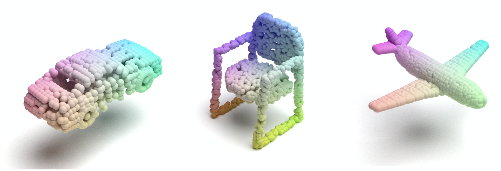

# Multiple Point Cloud Renderer using Mitsuba (2 or 3)

Calling the script **render_mitsuba3.py** automatically performs the following in order:

  1. Generates an XML file, which describes a 3D scene in the format used by Mitsuba.
  2. Calls Mitsuba 3 to render the point cloud. _(If using Mistuba 2, exports an EXR intermediate file)_
  3. Iterates for multiple point clouds present in the tensor (.npy)
  
It could process both plys and npy. The script is heavily inspired by [PointFlow renderer](https://github.com/zekunhao1995/PointFlowRenderer) and here is how the outputs can look like:



## Dependencies
* Python 3.8
* [Mitsuba 3](http://www.mitsuba-renderer.org/)  (Installed from pip)
* Used python packages for 'render_mitsuba2_pc' : OpenEXR, Imath, PIL

If you're using the mitsuba2 path, then ensure that Mitsuba 2 can be called as 'mitsuba' by following the
[instructions here](https://mitsuba2.readthedocs.io/en/latest/src/getting_started/compiling.html#linux).
Also make sure that the 'PATH_TO_MITSUBA2' in the code is replaced by the path to your local 'mitsuba' file.

## Instructions

### For the old mitsuba2

You may want to refer to the original repo [Mistuba2PointCloudRenderer](https://github.com/tolgabirdal/Mitsuba2PointCloudRenderer), but
this fork has an updated render_mitsuba2_pc.py so it works multiplatform. It also allows you to set the number of points per object.

Replace 'PATH_TO_MITSUBA2' in the 'render_mitsuba2_pc.py' with the path to your local 'mitsuba' file. Then call:
```bash
# Render a single or multiple JPG file(s) as:
python3.6 render_mitsuba2_pc.py chair.npy

# It could also render a ply file
python3.6 render_mitsuba2_pc.py chair.ply

# Render with a different number of points per object
python3.6 render_mitsuba2_pc.py chair.ply -n 2048
```

All the outputs including the resulting JPG files will be saved in the directory of the input point cloud. The intermediate EXR/XML files will remain in the folder and has to be removed by the user.

### For the new mitsuba3
Since its installed with pip, you just need to call the .py with python.

```bash
python3.7 render_mitsuba3.py chair.ply

# Render with a different number of points per object
python3.7 render_mitsuba3.py chair.ply -n 2048

# Specify the mitsuba variant ('scalar_rgb', 'scalar_spectral', 'cuda_ad_rgb', 'llvm_ad_rgb'). Check --help to list the options.
python3.7 render_mitsuba3.py chair.ply -v scalar_rgb
```

### Extra: 2-point cloud renderer
#### (points.hole+noise.ply, evaluated_pc.ply) -> restored_pc.png

There is also a variation that is able to render and merge two point clouds (fractured and evaluated) to show the restoration, for repairing point clouds.
```bash
python3.7 render_mitsuba3_2pc.py chair
```
Here, it will assume that there are two files: chair_points.hole+noise.ply and chair_evaluated_pc.ply,
and then it will render a chair_restored.png.

You can also use `*` to render all pairs in a folder, or with certain pattern. You may need to put the path between `"`,
like `"custom-folder/*"`.
```bash
python3.7 render_mitsuba3_2pc.py custom-folder/*
```

You can change the partial and evaluated input names, in case your .ply files are called different.
```bash
python3.7 render_mitsuba3_2pc.py custom-folder/* --partial_suffix _partial_pc.ply --evaluated_suffix _evaluated_pc.ply
```
Of course, you can change the render output's suffix.
```bash
python3.7 render_mitsuba3_2pc.py custom-folder/* --restored_suffix _restored_pc.png
```